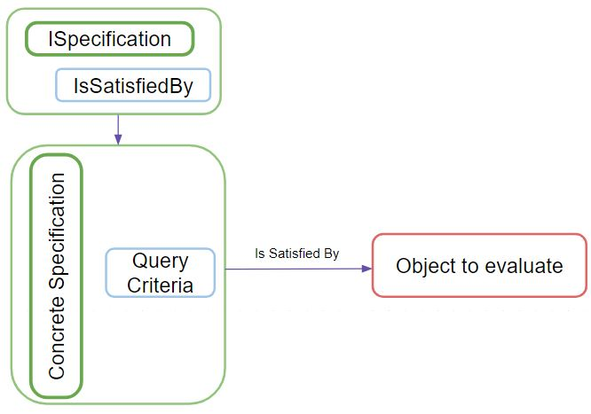
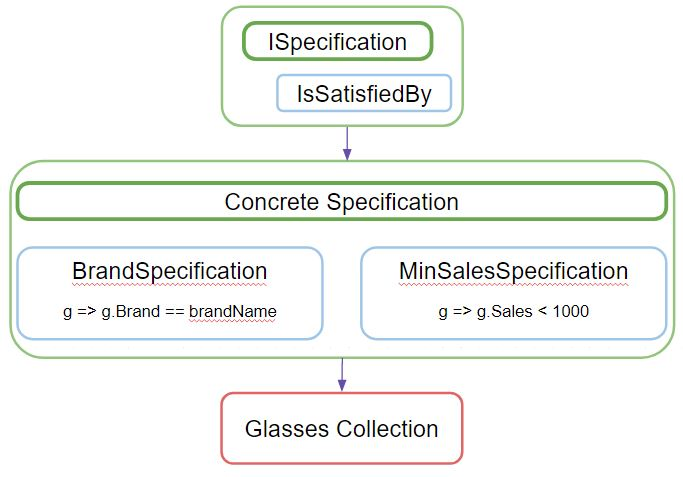

# Bridge Pattern

## ✅Goal

The Specification Pattern seeks the ability to being able to re use common business criteria along the application. This would be achieved by encapsulating the business logic into "specifications" classes that will define specific logic that would be able to be re used anywhere along the application. 

## 🌎Real case example

Let's have a better understanding with the following example:

We are developing an application related to glasses. We have the following functionalities:

* List glasses according to their brand or minimum number of sales
* Apply a discount to all glasses of the same brand or that match a minimum number of sales
* Filter the glasses displayed in the application according to their brand or those that match the minimum number of sales

In this example, we can identify that specific logic is being replicated across all the requirements we have. Those are:

* Logic according to the Brand
* Logic according to the Minimum Number of Sales

By identifying this kind of scenario, we match the requirements to consider implementing the Specification Pattern by decoupling this logic into specific classes that handle it which will allow us to re use it in all the requirements we need.

## 🏛Architecture

The participants of this pattern would be:

* The _**ISpecification**_ interface which will have our method _**IsSatisfeidBy**_.
* The _**Concrete Specifications**_ ****which are classes that will implement the _**ISpecification**_ interface and will handle the business logic in the _**IsSatisfiedBy**_ method.

Let's consider the example we saw in the previously. Having in mind the logic we identified, we can apply the pattern the following way:

* The _**ISpecification**_ would be our interface described by the pattern that will define the IsSatisfiedBy method.
* Our _**Concrete Specifications**_ would be the _**BrandSpecification**_ ****and _**MinSalesSpecification**_. Each of them will handle the logic that their own names express. 

This way, we have decoupled the logic of matching by brand name and minimum number of sales into specific classes that will allow us to re use them anywhere we need in our application.

## ☢What problems does it solve?


**Makes the system easier to maintain.**

Having the business logic decoupled and centralized in specific classes makes easier to identify where we need to make changes or updates.



**Makes the system scalable.**

Having the functionalities separated and focused, allow us to keep adding new features without affecting the created ones.


## ⏲When to use it?


**When having repetitive data access query criteria separated along the application.**

Taking the first example, we would end up having the same filter criteria for getting information from our data source. These would be the brand name and min. number of sales. When having this kind of repetitiveness applying this pattern will be very useful.



**When having complicated queries to understand.**

Some times, we might end up having complex queries in our repositories. By applying the pattern, we are able to extract that complexity out of our repositories requests and centralize them in specific classes that will express, by their names, what is their responsibility.



**When having repetitive validations or filters criteria**

Along our application, we might have some specific validations or filter criteria that needs to be  re used or used along the application in order to achieve certains flows. We can make use of this pattern in order to being able to have access to that business logic anywhere we need.


## ⏲When not to use it?


**When the specification won’t be re used.**

We might end up thinking that having the business logic decoupled and centralized in our specifications is the best approach to every scenario and consider it always. However, there is no advantage in implementing specifications, that will take time to implement, if they are only  going to be used once or even a couple of times.



**When the criteria you want to “specify” combine two different entities.**

One limitation of this pattern could be that it is very centralized in specifying the logic of a specific entity. However, some times our logic consider two or more different entities in order to achieve a specific flow. In this cases, this pattern wouldn't be applied.


## 🎭Effects

### Advantages


**Single Responsibility Principle**

With this pattern, this principle is being achieved by having each functionality separated and specialized in their correspondent class.



**Open/Closed Principle**

Once finished an implementation, you can keep creating additional specifications without affecting the created ones. 



**Scalability**

Having the functionalities separated allows an easier way to scalate simply by adding the functionalities without affecting the others.



**Loose coupling of the filter logic from the objects being filtered**

Having the logic separated, we are able to keep expanding our specifications without affecting the process or the "how to handle" the objects that are being filtered. 



**Specifications names express more clearly their responsibility.**

Having in mind we are decoupling complex query logic into a specification. We would be able to understand more clearly the responsibility of that specification by naming it properly. 



**Composition of specifications.**

The _**Composite Specification**_ is an implementation of the _**Specification Pattern**_ which allow us to combine specifications in order to create complex rules.


### Disadvantages


**Initial implementation effort.**

At the beginning, implementing the pattern may seen complicate to implement. This because there is a new consideration added to the process of developing the application which is identifying the business logic that actually needs to be decoupled into specifications in order to gain some benefit in the application. 



**Enforced encapsulation of business rules.**

This is related to the previous point. If we don't invest time identifying the business rules that are worth to be decoupled into specifications, we might end up having the wrond idea that every single business rule should be moved into a specification class.


## ‼Common mistakes when implementing


**Trying to encapsulate all the query criteria into specifications.**

If we don't invest time identifying the business rules that are worth to be decoupled into specifications, we might end up having the wrong idea that every single business rule, validation or filter criteria should be moved into a specification class.


## Demo


The demo is hosted on the next github repository


[\[Bridge Pattern Repository\]](https://github.com/jordinola/BridgePattern)

