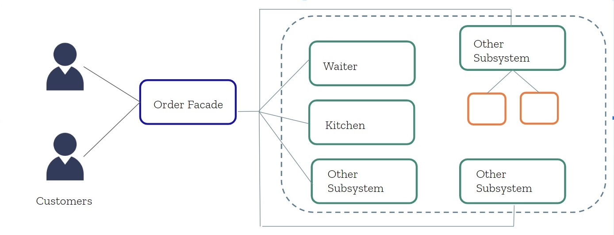
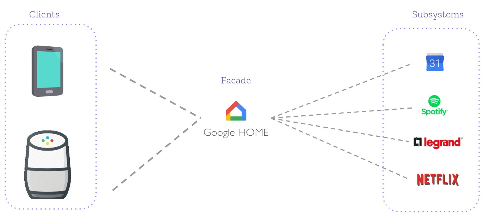

# Facade

## ✅Goal

_**"Simplify how to consume a complex existing system"**_

Facade pattern is often needed when there is a large number of interdependent classes or the system is very complex. It is used to hide the complexities of a larger system providing a simple interface to the client. In other words, it is a wrapper class used to hide the implementation details and minimizing the communication and dependencies between subsystems.

Two keywords to help us understand this pattern are:

1. **Simplication** This is the goal of this design pattern. Simplify a complicated system.
2. **Restriction** Simplification often comes with a “sacred cost”, restriction. By simplifying the code, we restrict clients from fully functionality  in comparison to working with the subsystem directly. However, it includes only those features that clients really care about.

## 🏛Architecture

Let’s take an common situation where facade pattern is being applied. Customers on a restaurant order food from the menu, then the order goes to the kitchen and food comes back after a while  
Customers doesn’t need to know and don't care about the details happening inside the ktichen like who will cut the vegetables, how to prepare the meat or who is going to wash the dishes.  
The menu serves as the facade that makes easier for the customer to get the food avoiding the complexities coming from the kitchen.

So, translating our example to an architecture diagram we have:

1. Our customers are the clients who need to consume the subsystems.
2. The menu is the facade that hides all the complexity of the subsystems making them easier to be consumed by the clients
3. All the roles in the kitchen are the subsystems that are hidden from the client

## 🌎Real case example

Let’s think on another case where this pattern is applied.  
We have a lot of applications we frequently use as Calendar, Spotify, Netflix and so many others.  
We also have Google Assistant app, which let us interact with all the other apps in a simplified way by creating routines.  
When we setup a routine on google home assistant it can involve, turn on the lights with Legrand app, play some spotify playlist, read the news, and so on without having to open each application. All that complexity is hidden from us by using the google assistant app.  
Google assistant makes easier for the clients \(as google home speaker or mobile phone\) to interact with our applications. 

Therefore Google assistant is serving as a facade which makes easier for the clients to interact with subsystems hiding all that complexity.

## ☢What problems does it solve?


**Reduces the learning curve of the subsystem.**   
Clients don't need to fully understand what the subsystem is doing so we are taking down the learning curve.



**Makes a subsystem easier to use by wrapping it.**   
We provide a much more easier and friendlier way to consume the subsystems by hiding the complexity inside the facade.



**Decouple subsystems from its clients.**  
Clients are no longer tightly coupled to subsystems.



**Limit/restrict features and flexibility that users may need.**  
Imagine you need to integrate your app with a complex and sophisticated library which has tons of features, but you just need a tiny bit of its functionality. Facade will restrict/limit the functionality by including only those features that clients really care about.


## ⏲When to use it?


**Need to expose a complex system in a simplified way to consume and use.**  
Facade is handy when you have a **complex system** that you want to expose to clients in a simplified way, or you want to make an external communication layer over an existing system which is incompatible with the system.



**A system is too complex and difficult to understand.**  
The aim of this pattern is simplify a complicated system displaying a friendly face by hiding all the complexities.



**Wrap a poorly designed API in a better designed one.**  
It allows to hide poorly designed APIs or legacy code behind well designed facades.



**Expose a set of complex interactions with a single interface.**  
It allows you to expose a set of complex interaction between the subsystems through a single interface that appears simple on the outside.



**Integrate your app with sophisticated libraries with tons of functionality.**  
Sophisticated libraries handles tons of complex functionality. If you only need a few set of its functionalities then Facade will became really handy because it allows you to expose only those features that your application needs.



**When you are planning to change the subsystem in the future.**  
If you would like to be able to change implementation of subsystem in the future, while still providing consistent functionality through a stable interface.


## 🎭Effects


**Existing subsystem is simplified.**  
Complexity is hidden to provide a much more easier and friendlier way to be consume it.



**Create new/Update Facade to expose more functionality.**  
Facade expose a limited set of subsystems functionalities. So if we need to expose more subsystems features we will need to either update the existing facade or create a new one.



**Full capability of subsystems will not be avaiable from Facade**  
Facade will limit the features and flexibility that subsystems can offer.


## ‼Common mistakes when implementing


**Creating unnecessary facades.**   
When we apply this pattern just for the sake of create a facade layer instead of assess deeply wheter applying it is adding real value to our design. Keeping in mind YAGNI and KISS principles will help us.



**Forcing client classes to interact with subsystem through the facade.**  
Facade layer should not be forced and its always optional. If the client wishes to interact with components directly it should be allowed to bypass the facade layer.



**Create facade layer for simple calls**  
Imagine facade with methods that has only one or two lines which calls the other subsystems. If facade is going to be so simple it invalidates its purpose \(It’s supposed to encapsulate complexity\) and would be better to let clients call directly the subsystems and avoid an unnnecesary layer.reate facade layer for simple calls. 



**Creating facade layer in advance.**  
Don't create facades in advance just because you feel the subsystem might evolve and become complicated. You might end up introducing an abstraction layer you may not use. YAGNI principle will help you to avoid adding unnecesary complexity.



**Reference for facade in subsystems.**  
Subsystems are not aware of facade. So there should be no reference for facade in subsystems.



**Adapter and Facade are both wrappers but they are differents.**  
The intent of Facade is to produce a simpler interface while the intent of Adapter is make two existing interfaces work together.



**A facade can become a god object coupled to all classes of an app**  
If we not pay enough attention facade can easily become a god object coupled to all classes of an app.


### Summary


Facade provides a single interface.



Developers comfort is a main purpose of facade.



Simplicity is the aim of facade.



Facade promotes subsystem independence and portability.



Subsystem may be dependent with another one. 


### Related Patterns


**Adapter**  
Facade defines a new interface for existing objects, whereas Adapter pattern changes the interface of one or more classes into one interface that a client is expecting.



**Abstract Factory**  
Abstract Factory can serve as an alternative to Facade when you only want to hide the way the subsystem objects are created from the client code.



**Mediator**  
Facade and Mediator try to organize collaboration between lots of tightly coupled classes.  
  
Facade defines a simplified interface to a subsystem of objects and subsystems are unaware of the facade. Objects within the subsystem can communicate directly.   
  
Mediator centralizes communication between components of the system. Components only know about the mediator object and don’t communicate directly.



**Proxy**  
Facade is similar to Proxy in that both buffer a complex entity and initialize it on its own. Unlike Facade, Proxy has the same interface as its service object, which makes them interchangeable.


## Demo 


The demo is hosted on the next github repository


\[Link here\]

